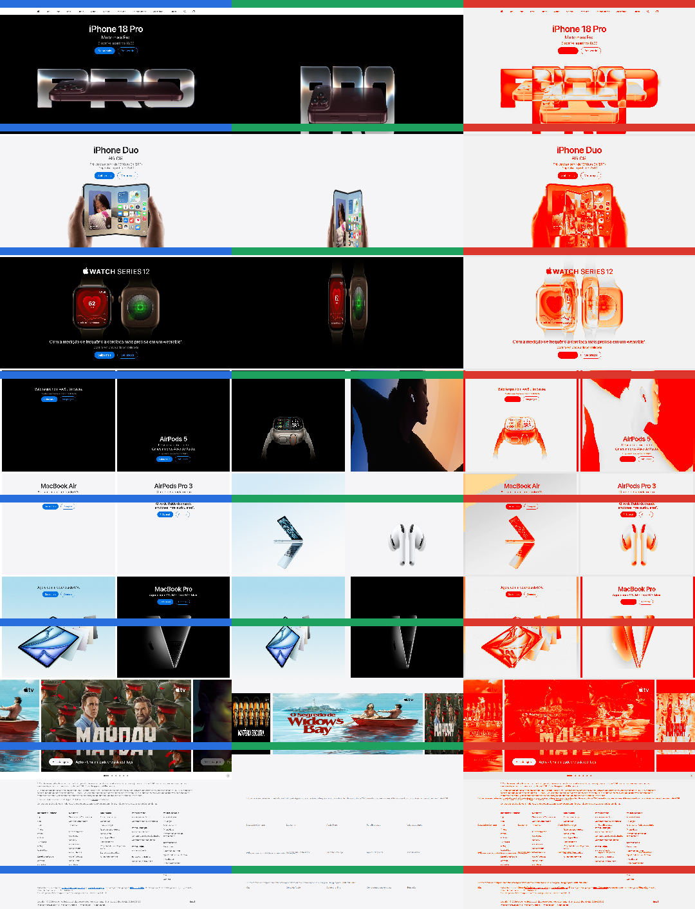
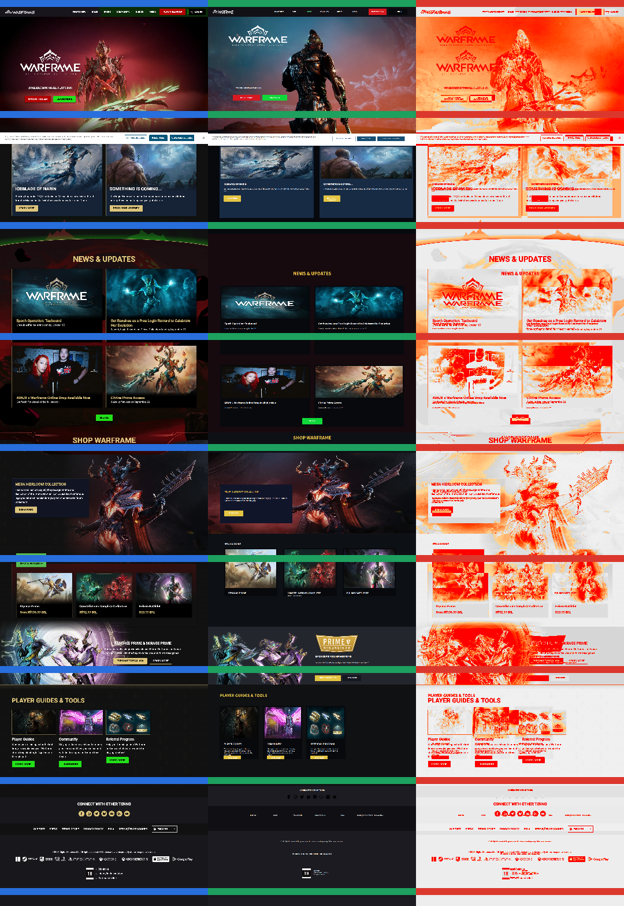
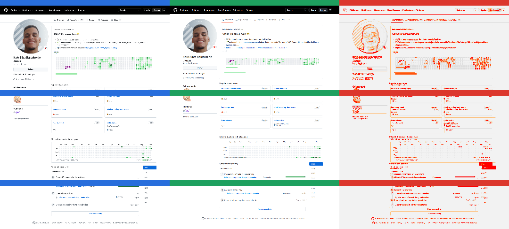

# Benchmark de sites

Runs de reprodução pública em viewport base 1440×900.

Cada run preserva a fonte, decisões, frame-spec e o paralelo visual gerado
pela análise. Cada benchmark usa sua estrutura normal diretamente na raiz do
pacote; não há diretório de versões arquivadas. O conteúdo v4 é a reconstrução
oficial/canônica escolhida pelo usuário. O avaliador regional `penpot-visual-v2`
continua sendo um gate automático independente da aceitação humana.

| Site | Run | Estado |
|---|---|---|
| Apple Brasil | [Apple v4](apple-br/README.md) | CANÔNICA · gate automático `NEEDS_REVIEW` · `71,38 → 71,08 → 71,04` |
| Warframe English | [Warframe v4](warframe-en/README.md) | CANÔNICA · gate automático `NEEDS_REVIEW` · `64,23 → 65,38 → 64,03` |
| GitHub kaio-baleeiro | [GitHub v4](github-kaio-baleeiro/README.md) | CANÔNICA · gate automático `NEEDS_REVIEW` · `83,79 → 83,92 → 84,10` |

## Galeria v4 — ciclo final

O detail board mostra fonte, export do Penpot e heatmap em faixas verticais
legíveis. Os links laterais dão acesso às imagens completas.

| Site | Detail board | Comparações completas |
|---|---|---|
| Apple Brasil |  | [side-by-side](apple-br/analysis/v4-cycle-3-home-side-by-side-annotated.png) · [overlay](apple-br/analysis/v4-cycle-3-home-overlay.png) · [heatmap](apple-br/analysis/v4-cycle-3-home-heatmap.png) |
| Warframe English |  | [side-by-side](warframe-en/analysis/v4-cycle-3-home-side-by-side-annotated.png) · [overlay](warframe-en/analysis/v4-cycle-3-home-overlay.png) · [heatmap](warframe-en/analysis/v4-cycle-3-home-heatmap.png) |
| GitHub kaio-baleeiro |  | [side-by-side](github-kaio-baleeiro/analysis/v4-cycle-3-home-side-by-side-annotated.png) · [overlay](github-kaio-baleeiro/analysis/v4-cycle-3-home-overlay.png) · [heatmap](github-kaio-baleeiro/analysis/v4-cycle-3-home-heatmap.png) |

Os quatro artefatos também estão publicados para os ciclos 1 e 2 com o prefixo
`v4-cycle-N-` em cada pasta `analysis/`. Apple e Warframe falharam score e
cobertura; GitHub passou cobertura, mas não o score. Isso mantém o estado
automático `NEEDS_REVIEW`, sem retirar a aceitação humana da v4 como canônica.

## Quickstart no Penpot

1. Abra [http://localhost:9001](http://localhost:9001) e entre na instância
   local.
2. No projeto `Penpot Benchmarks`, abra o arquivo `Site Benchmarks`.
3. Selecione a página e o frame indicados no README de cada benchmark. Os IDs
   registrados nos manifests v4 são a referência inequívoca quando houver nomes
   duplicados.

Cada pacote contém `source/` (referência e procedência), `design/` (plano,
inventários e log MCP), `exports/` (renders dos frames editáveis) e `cycles/` (score,
issues, relatório, comparação, overlay e heatmap). Os artefatos publicados são
sanitizados e não incluem cookies, tokens ou estado de sessão.

## Como ler a validação

- `score` resume seis heurísticas visuais ponderadas; o mínimo automático é 90.
- `coverage` mede quanto do conteúdo comparável foi coberto; o mínimo é 80%.
- P0/P1 são divergências bloqueantes. Um passe exige score e coverage mínimos,
  zero P0/P1 e inventário estrutural válido.
- `detail board` recorta a página longa em faixas legíveis; `side-by-side`
  mostra fonte e render completos; `overlay` evidencia deslocamentos; `heatmap`
  localiza a intensidade das diferenças.
- `exports/cycle-3.png` é o render do frame editável no Penpot;
  `source/reference.png` é somente a evidência de origem.

“Canônica” significa que o usuário escolheu a v4 como baseline oficial. Não
significa que o gate automático passou, nem promove o estado para `DELIVERED`.
