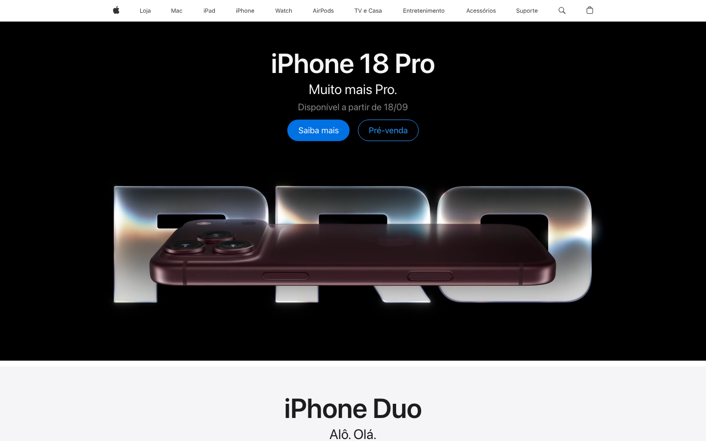
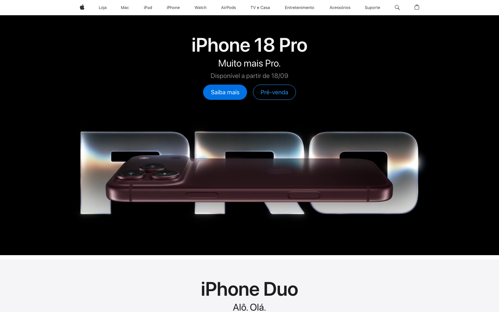
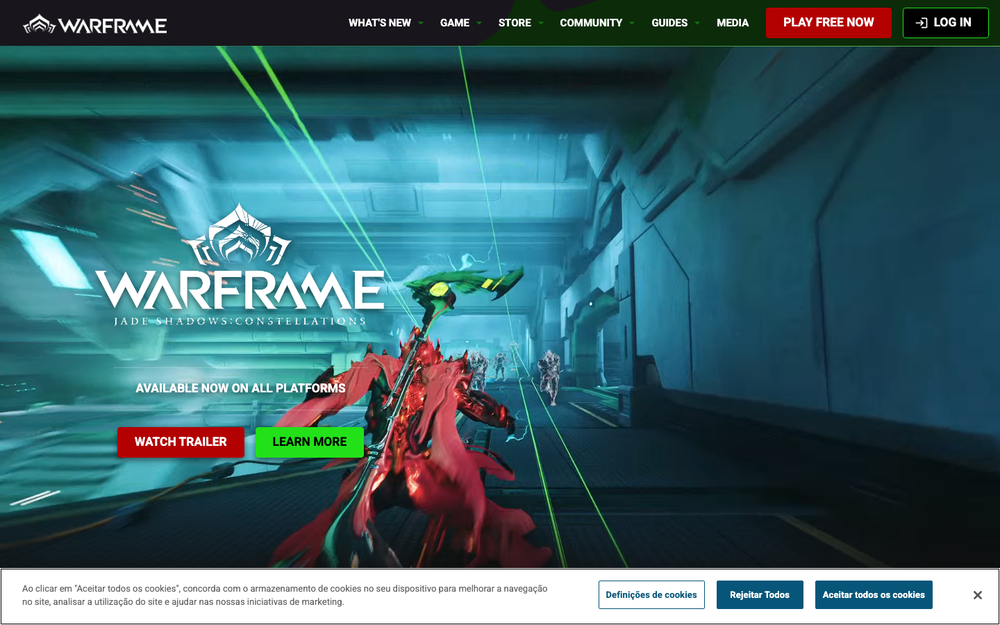
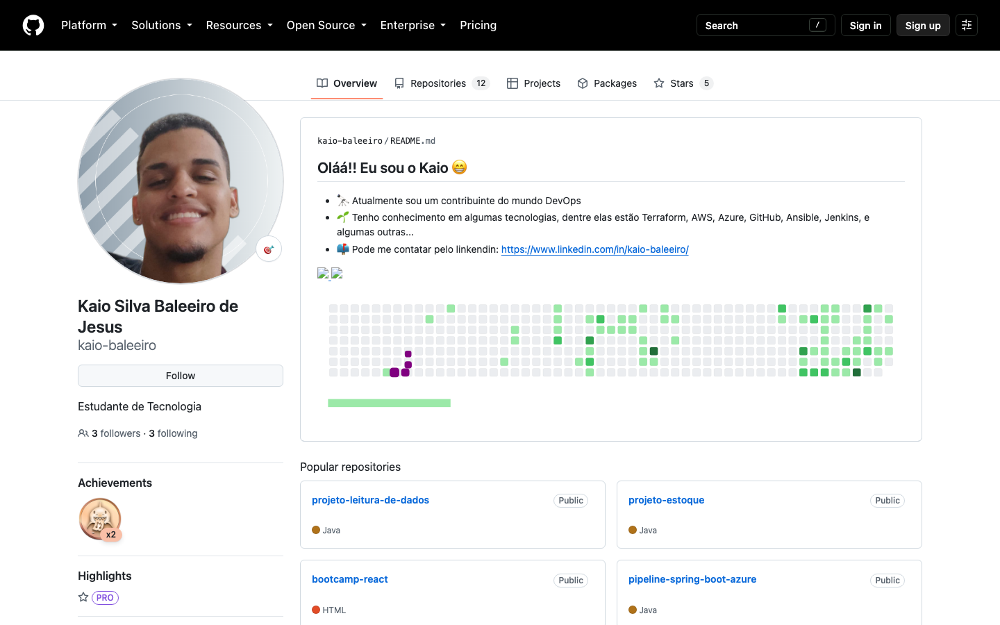
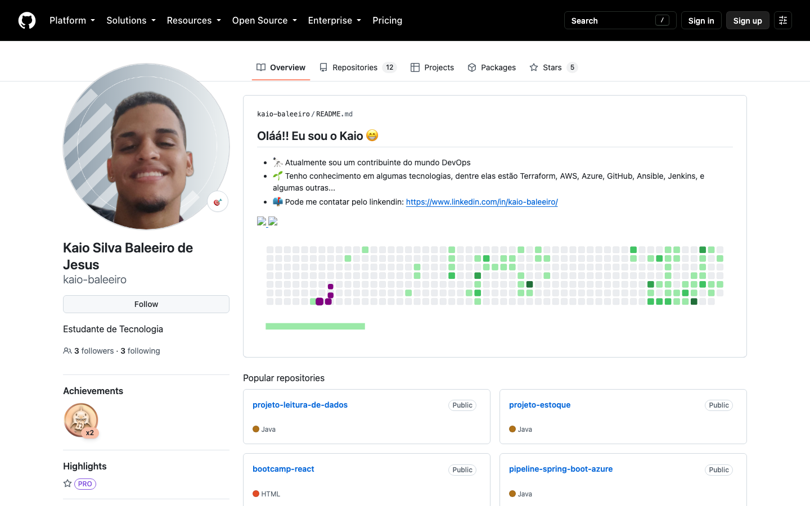

# Benchmark de sites

Runs de reprodução pública em viewport base 1440×900.

Cada run preserva a fonte, decisões, frame-spec e o paralelo visual gerado
pela análise. As imagens abaixo são evidências públicas sanitizadas; o score
fica ausente quando o gate não pôde comparar um export do Penpot.

| Site | Run | Estado |
|---|---|---|
| Apple Brasil | [apple-br](apple-br/README.md) | NEEDS_REVIEW |
| Warframe English | [warframe-en](warframe-en/README.md) | NEEDS_REVIEW |
| GitHub kaio-baleeiro | [github-kaio-baleeiro](github-kaio-baleeiro/README.md) | NEEDS_REVIEW |

## Galeria de análise

| Site | Referência | Side-by-side | Overlay | Heatmap |
|---|---|---|---|---|
| Apple Brasil |  |  | [overlay](apple-br/analysis/overlay.png) | [heatmap](apple-br/analysis/heatmap.png) |
| Warframe English |  |  | [overlay](warframe-en/analysis/overlay.png) | [heatmap](warframe-en/analysis/heatmap.png) |
| GitHub kaio-baleeiro |  |  | [overlay](github-kaio-baleeiro/analysis/overlay.png) | [heatmap](github-kaio-baleeiro/analysis/heatmap.png) |
